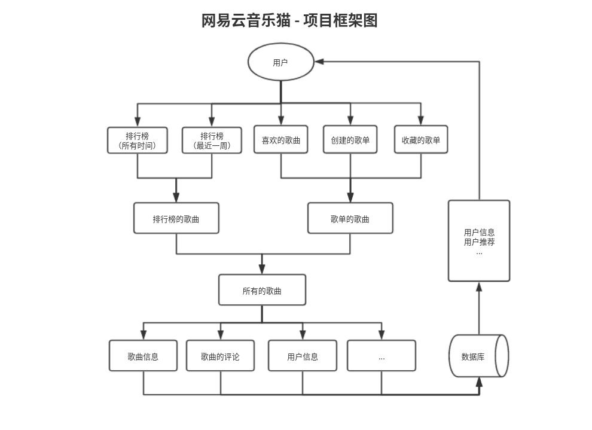
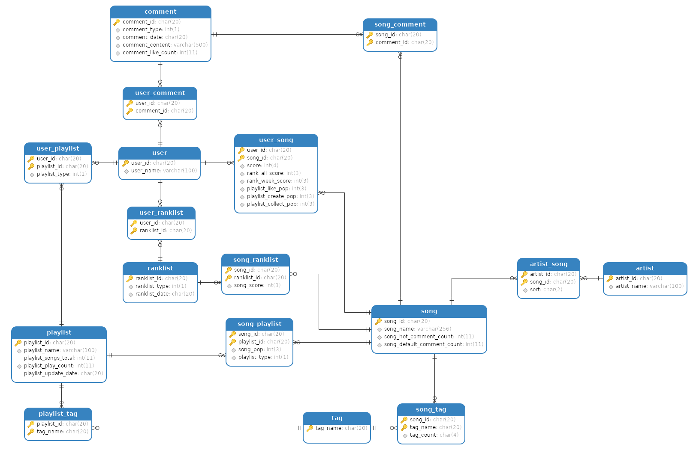

<div align="center">
<h1>
 Netease Music Cat
</h1>
<a href=""></a>
<a href=""></a>
</div>

---

## 项目简介

#### 本项目**实现**：

- 网易云音乐爬虫，包括：
  
  - 某用户的排行榜 
  
  - 某用户的所有歌单  (可指定歌单种类及范围)
  
  - 某用户的所有歌单的所有歌曲  (可用于备份导出)
  
  - 某歌单的所有歌曲
  
  - 某歌曲的所有热门评论
  
  - 某歌曲的最新及最旧共计一万条评论
  
  
  
- 网易云音乐听歌报告生成，包括：(开发中...)
  
  - 某用户的听歌报告生成
  - 某用户的歌曲评论信息 (包括公开及部分未公开评论)
  - ...
  
  
  
- 网易云音乐歌曲推荐，包括: (开发中...)
  
  - 基于用户的协同过滤算法
    
    影响因子
    
    - 基于用户排行榜 (排行榜种类,歌曲播放量得分)
      - 最近一周排行榜
      - 所有时间排行榜
    - 基于用户的歌单 (歌单种类,歌单播放量,歌单标签)
      - 喜欢音乐歌单
      - 创建的歌单
      - 收藏的歌单
    - 由排行榜和歌单获得的歌曲 (歌曲标签,歌曲歌手)
    

#### 本项目的**数据来源**为网易云音乐官方API:

- weapi
- eapi

## 项目框架图



## 数据库关系模型



## 安装方式

```shell
"下载到本地
git clone https://github.com/humingk/netease_music_cat


"配置依赖包
cd netease_music_cat
pip install -r requirements.txt -i https://mirrors.aliyun.com/pypi/simple


"配置数据库
cd my_tools
mysql -uroot -p < music.sql


"配置config.py

待续...
```

## 使用方式

config.py 为用户个性配置文件

运行日志详见logger.log

模块中有详细的文档，按文档调用相应函数即可

以下为部分函数示例：

```python
# 获取某个用户的排行榜
	def get_user_ranklist_songs(user_id=[用户ID], rank_type=[排行榜类型], rank_max=[获取排行榜歌曲最大数]):

# 获取某个用户的歌单
    def get_user_playlists(user_id=[用户ID], 
                           created_playlists_max=[创建歌单最大获取数],
                           collected_playlists_max=[收集歌单最大获取数],
                           is_playlists_default=config.is_playlists_default,
                           is_playlists_created=config.is_playlists_created,
                           is_playlists_collected=config.is_playlists_collected):

# 获取某个用户所有歌曲
    def get_playlist_songs_by_user_id(self, user_id=[用户ID], default_songs_max=config.default_songs_max,
                                      created_songs_max=config.created_songs_max,
                                      collected_songs_max=config.collected_songs_max,
                                      created_playlists_max=config.created_playlists_max,
                                      collected_playlists_max=config.collected_playlists_max,
                                      is_playlists_default=config.is_playlists_default,
                                      is_playlists_created=config.is_playlists_created,
                                      is_playlists_collected=config.is_playlists_collected):

# 获取某个歌曲的评论
	# 热门评论
    def get_song_comments_hot(self, song_id, song_comments_hot_max=config.song_comments_hot_max,
                              thread_count=config.song_comments_thread_count,
                              thread_inteval_time=config.song_comments_thread_thread_inteval_time,
                              song_comments_page_limit=config.song_comments_page_limit):   
     # 标准评论
        def get_song_comments_default(self, song_id, thread_count=config.song_comments_thread_count,
                                  thread_inteval_time=config.song_comments_thread_thread_inteval_time,
                                  song_comments_new_max=config.song_comments_new_max,
                                  song_comments_old_max=config.song_comments_old_max,
                                  song_comments_page_limit=config.song_comments_page_limit):
            
# 针对用户进行歌曲推荐(开发中)
# 详见 recommender/user_collaborative_filtering.py
```
