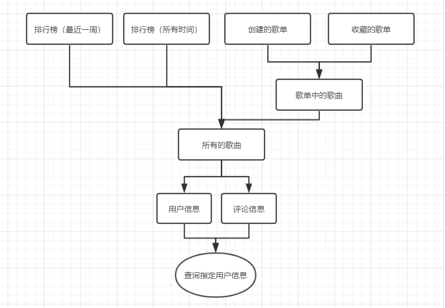
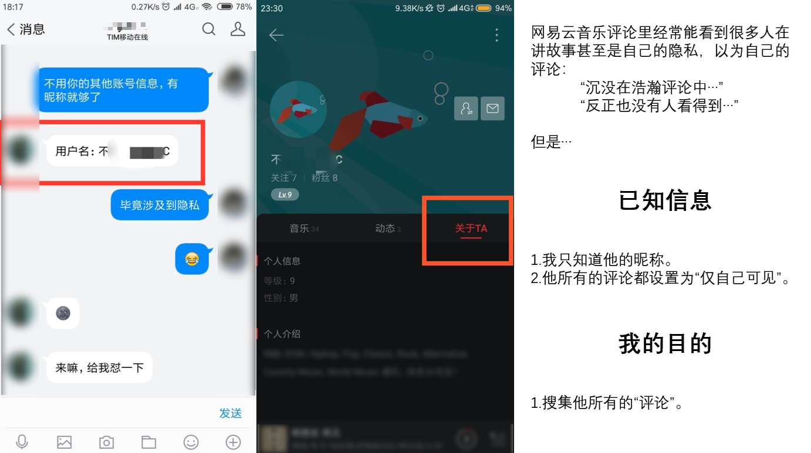
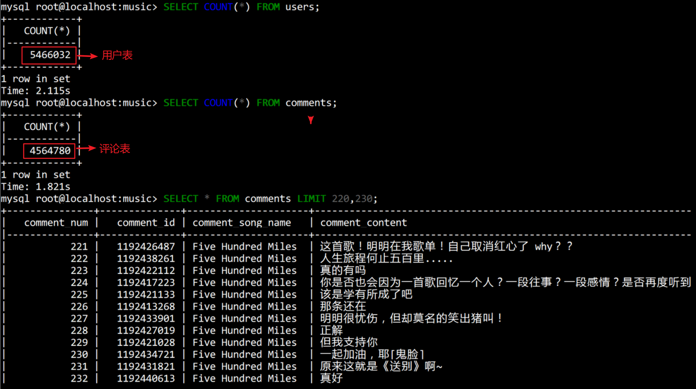
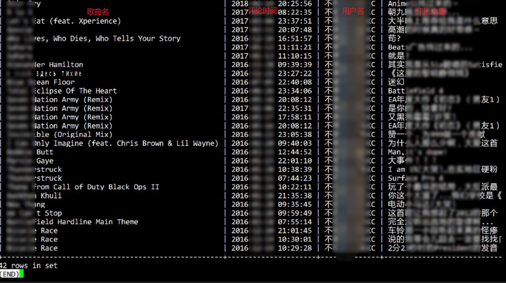
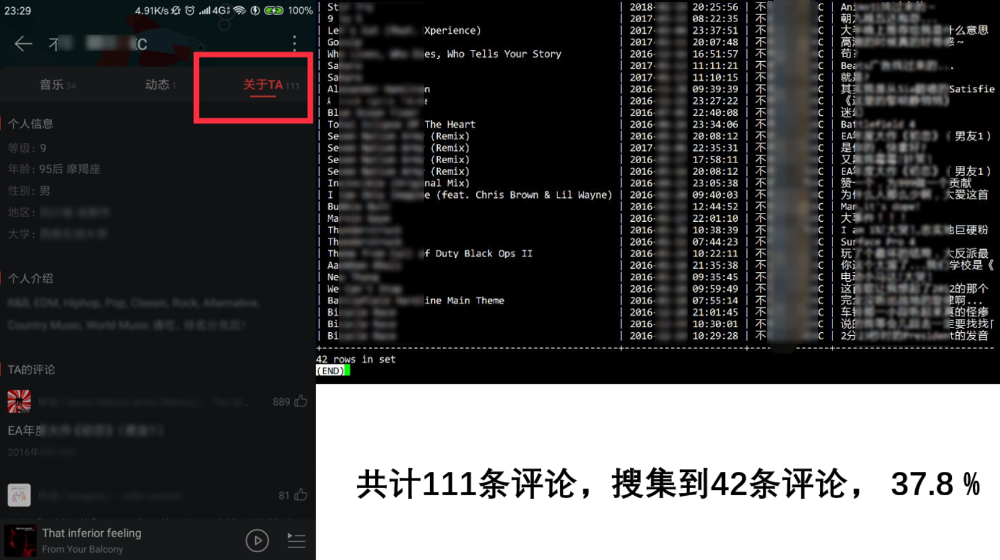

[施工] 正在代码重构中...

# 项目简介

**本项目实现**：

- 对某用户某歌单某首歌的评论进行爬取

- 对某用户在网易云音乐中的歌曲评论(仅自己可见)进行爬取
- 通过歌单、排行榜、听歌量等等对某用户进行分析，生成报告

- 对某用户进行歌曲推荐

  

# 安装方式

# 使用方式

# 1.0使用案例（2.0正在开发中）

# 流程图

# 效果预览

- 获取隐私权限许可

- 爬取到的结果(数据后期可做分析用)

- 在结果中对此用户进行查询

- 查询到的评论数/实际评论数 百分比

# 待解决的问题

1. 多进程改为多线程，加入线程锁

2. 改进IP可用与不可用的切换

3. 爬取、解析、存储改为多线程进行

5. 考虑是否仅存储有用信息

5. 加入自定义时间限制

   

**友情链接**：

- [IPProxyTool](<https://github.com/awolfly9/IPProxyTool>)